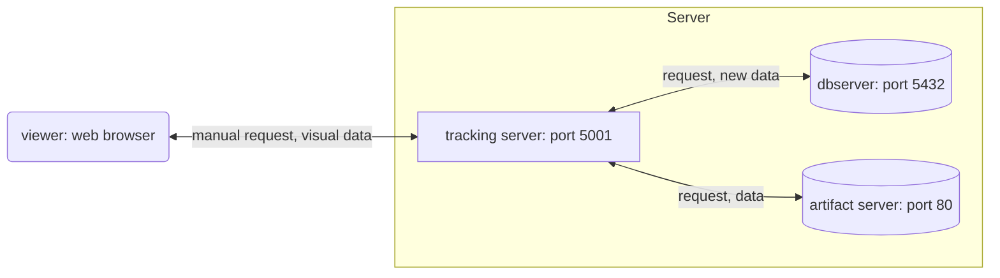

# Usage

The name of the Docker volume is set to "mlflowv3". Change it accordingly in case of conflicts. In such cases, modify "mlflowv3" on this page to a different volume name.

## 1. Creating a Docker Volume

```sh
docker volume create mlflowv3
```

## 2. Starting the Containers

```sh
docker-compose up -d
```

Check the logs to ensure that the containers are running. Once confirmed, close the logs with CTRL+C.

```sh
docker-compose logs --follow
```

Changed to create an ftp-server locally based on [this Qiita article](https://qiita.com/c60evaporator/items/e1fd57a0263a19b629d1#%E3%82%B7%E3%83%8A%E3%83%AA%E3%82%AA4-mlflow-with-remote-tracking-server-backend-and-artifact-stores). .env file should be created as necessary.

## **A bit important**: Accessing Database Files Directly

With the current settings, accessing the data files saved in the volume directly is difficult. Therefore, when debugging data files, etc., enter the container with the following command. Change the container name as appropriate. \
`docker-compose exec` did not start sh for some reason.

```sh
docker exec -it db-server sh
```

After entering the container with the above command, debug the database files in `/var/lib/mysql` (probably `/var/lib/postgres/data` if using Postgres), or copy the database files to a directory mounted by the following command.

```sh
cp -r /var/lib/mysql /data_backup
```

## **Important**: Re-creating Containers in Case of Errors, etc.

With the settings as is in the docker-compose.yaml, the database is initialized as an empty database. Conversely, when there is data in `/var/lib/mysql`, **it fails to initialize with an error**. Therefore, recreate the volume with the following code. Naturally, all data within the volume will be discarded. Refer to [the section above](#**A bit important**: Accessing Database Files Directly) if you want to take a backup of the data.

```sh
docker volume rm mlflowv3
docker volume create mlflowv3
```

## Configuration



## References

https://qiita.com/c60evaporator/items/e1fd57a0263a19b629d1