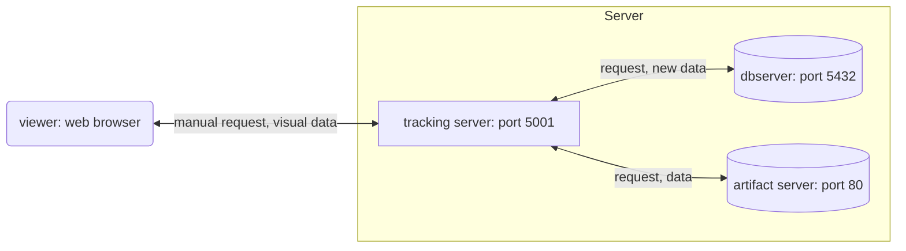

# Usage

The name of the Docker volume is set to `mlflowv3`. If a conflict arises, please change it accordingly. In such cases, rename `mlflowv3` on this page to a different volume name.

## 1. Create a Docker volume.

```sh
docker volume create mlflowv3
```

## 2. Start the containers.

```sh
docker-compose up -d
```

Check the logs to ensure that the containers are running. Once confirmed, close the logs with CTRL+c.

```sh
docker-compose logs --follow
```

[This Qiita article](https://qiita.com/c60evaporator/items/e1fd57a0263a19b629d1#%E3%82%B7%E3%83%8A%E3%83%AA%E3%82%AA4-mlflow-with-remote-tracking-server-backend-and-artifact-stores) has been modified to create the ftp-server locally. `.env` should be created as needed.

## **Important Note**: Accessing database files directly.

In the current setup, accessing the data files saved in the volume directly is challenging. Therefore, when debugging data files or performing similar tasks, use the following command to enter the container. Remember to change the container name as needed.\
`docker-compose exec` did not seem to launch `sh` for some reason.

```sh
docker exec -it db-server sh
```

Once inside the container with the above command, debug the database files in `/var/lib/mysql` (or `/var/lib/postgres/data` if using Postgres), or copy the database files to a directory mounted on the host using the following command:

```sh
cp -r /var/lib/mysql /data_backup
```

## **Important**: Rebuilding containers in case of errors.

In the default configuration of `docker-compose.yaml`, the database is initialized as an empty database. Conversely, if data exists in `/var/lib/mysql`, **initialization fails and results in an error.** Therefore, regenerate the volume using the following code. Note that all data within the volume will be discarded. Refer to the [above section](#**Important Note**: Accessing database files directly.) if you want to backup the data.

```sh
docker volume rm mlflowv3
docker volume create mlflowv3
```

## Configuration



## Reference

https://qiita.com/c60evaporator/items/e1fd57a0263a19b629d1

